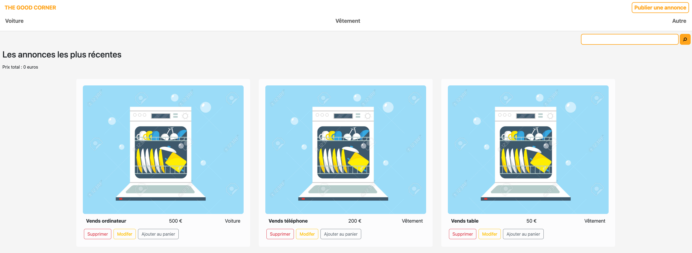

# THE GOOD CORNER

"The Good Corner" est un projet vu en formation CDA au sein de l'école **Wild Code School**.


## Stacks utilisées  

JS, TS, REACT, TypeORM, SQLite

## Installation

1. Installer les dépendances avec ```npm install```
2. Se mettre dans le backend et importer les requêtes sql dans SQLIte
3. Puis lancer le serveur avec ```npm run start```
4. Puis se mettre dans le frontend et lancer le serveur front avec ```npm run dev```